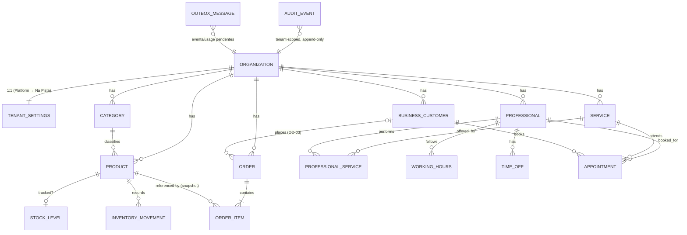

# Modelo de domínio (conceptual)

> Conceptual. **Sem migrations, sem DDL definitivo.** Tudo é escopo do Na Pista; nada disto vive no Platform.
> Convenção nos blocos de decisão: **DECISION / RATIONALE / IMPACT / FUTURE**. Onde o conceito oficial não
> permite decidir com segurança: **OPEN DECISION (OD-nn)** — com uma recomendação, mas **não** tratada como decidida.
> Estado: 🟩 CORE · 🟨 OPTIONAL/PHASE 2 · ⬜ FUTURE.

## 1. ERD conceptual

`organization_id` está implícito em **todas** as entidades abaixo (ver `tenancy.md`). Referências entre
entidades usam chave composta `(organization_id, id)`.

| Entidade | Estado | Módulo |
|---|---|---|
| `TenantSettings` | 🟩 | TENANT |
| `Product`, `Category` | 🟩 | PRODUCTS |
| `BusinessCustomer` | 🟩 | CUSTOMERS |
| `StockLevel`, `InventoryMovement` | 🟨 | INVENTORY |
| `Order`, `OrderItem` | 🟨 | ORDERS |
| `Service`, `Professional`, `ProfessionalService` | 🟨 | SERVICES / PROFESSIONALS |
| `WorkingHours`, `TimeOff` | 🟨 | SCHEDULING |
| `Appointment` | 🟨 | APPOINTMENTS |
| `AuditEvent`, `OutboxMessage` | 🟩 (infra, transversal aos módulos) | shared |
| `ProductVariant` | ⬜ (OD-02) | PRODUCTS |
| `Location` | ⬜ (OD-06) | INVENTORY |
| `Availability` | — **não é entidade**: calculada | SCHEDULING |

## 2. Product domain

### PD-1 — Product é global ou tenant-scoped?
- **DECISION:** tenant-scoped. Não existe catálogo global de produtos.
- **RATIONALE:** o conceito é gestão *dos processos da empresa*; o "iogurte" da loja A e o da loja B são dados diferentes. Um catálogo global exigiria governação, deduplicação e modelo de partilha que ninguém pediu.
- **IMPACT:** `products.organization_id NOT NULL`; sem leitura cruzada.
- **FUTURE:** catálogos partilhados/franchising = módulo novo, não alteração do isolamento.

### PD-2 — Category é tenant-scoped?
- **DECISION:** sim. Hierarquia: **OD-08** (recomendação: plana no primeiro slice; `parent_id` só quando houver requisito).
- **RATIONALE:** cada empresa organiza o seu catálogo. Plana = mais simples e reversível (acrescentar `parent_id` nulo depois é aditivo).
- **IMPACT:** `categories(org, id, name)`; `products.category_id` opcional (FK composta).
- **FUTURE:** árvore de categorias, ordenação, imagens.

### PD-3 — Stock pertence a Product ou a Variant? Há variantes?
- **OPEN DECISION (OD-02).** O conceito oficial não diz se produtos têm variantes (tamanho/cor/sabor). Uma boutique *provavelmente* precisa; não se assume.
- **Recomendação:** slice 1 **sem** variantes; `OrderItem` e `StockLevel` referenciam `product_id`. Se variantes vierem, acrescentar `variant_id` nullable e um `default variant` implícito — migração aditiva mas não trivial. **Risco assumido** (ver R-04 em `f18-review.md`).
- **IMPACT se decidido "com variantes desde já":** a unidade vendável passa a ser a variante; `Product` vira agrupador; muda Inventory e OrderItem.

### PD-4 — Como se representa preço?
- **DECISION:** inteiro em **unidades menores da moeda** (`price_minor bigint`) + `currency_code` no `TenantSettings` (uma moeda por tenant no v1). **Nunca** `float`/`double`.
- **RATIONALE:** sem erro de arredondamento; o Platform já rejeitou `double` pelo mesmo motivo (usage usa `numeric`).
- **IMPACT:** o `OrderItem` guarda **snapshot** do preço e da descrição no momento da venda (alterar o produto não reescreve pedidos passados).
- **OPEN:** moedas/países suportados, casas decimais por moeda, multi-moeda por tenant → **OD-01**. Impostos: **FUTURE, fora do core** (não se assume IVA/legislação).

### PD-5 — Como se representa disponibilidade?
- **DECISION:** dois eixos independentes: `Product.status` (`DRAFT | ACTIVE | ARCHIVED` — *vendável ou não*) e, se `track_inventory = true`, a quantidade em `StockLevel` (*há unidades ou não*). "Disponível" = `ACTIVE` **e** (não rastreia stock **ou** quantidade > 0, sujeito a OD-05).
- **RATIONALE:** um produto pode estar à venda sem gestão de stock (serviços de balcão, encomendas) e vice-versa.
- **IMPACT:** `INVENTORY` é opcional; PRODUCTS funciona sozinho.
- **FUTURE:** reservas de stock, pré-venda.

### PD-6 — Produtos sem stock
- **OPEN DECISION (OD-05).** Bloquear venda / permitir stock negativo (backorder) / configurável por tenant?
- **Recomendação:** por omissão **bloquear** (falha segura), com definição por tenant só se o negócio pedir.

### PD-7 — Existe SKU? Barcode? Unidade de medida? Localização/armazém?
- **SKU — DECISION:** campo **opcional**, único por tenant quando presente (`UNIQUE (organization_id, sku)`, parcial). RATIONALE: identificador de gestão do próprio tenant, custo quase nulo. IMPACT: não obrigatório.
- **Barcode — OD-07** (recomendação: adiar; só campo texto opcional quando houver leitura por scanner).
- **Unidade de medida e quantidades fraccionárias — OD-04.** Iogurte à unidade vs. produto a peso. Recomendação: `unit` texto livre curto (default `"unit"`) e quantidade `numeric` — mas só decidir com o negócio.
- **Localização/armazém — FUTURE (OD-06).** Modelar `StockLevel` por `(product, location?)` deixa `location` nulo = local único. O limite `max_locations` do brief fica FUTURE.

### PD-8 — Order exige Customer? Pode ter produtos diferentes?
- **Produtos diferentes — DECISION:** sim, `Order 1—N OrderItem`, cada item = 1 produto + quantidade + snapshot de preço.
- **Customer obrigatório — OPEN DECISION (OD-03).** Venda de balcão sem cliente identificado é comum; o conceito não define. Recomendação: `customer_id` **nullable**.
- **Estados do pedido:** conjunto mínimo a validar com o negócio; proposta `DRAFT → CONFIRMED → COMPLETED | CANCELED`. Pagamento/entrega **fora** (Micha Express / Foi — FUTURE).
- **Movimentos de stock:** confirmar/cancelar pedido gera `InventoryMovement` (append-only) na mesma transacção; o stock nunca é editado directamente.

## 3. Service domain

### SD-1 — Pertença ao tenant e relações
- **DECISION:** `Service` e `Professional` são tenant-scoped. Um `Professional` pode executar vários `Service`, e um `Service` pode ser executado por vários `Professional` → `ProfessionalService` (N:M).
- **RATIONALE:** definido pelo conceito ("profissionais", "serviços"); N:M é o mínimo que não bloqueia equipas reais.

### SD-2 — Serviço e duração
- **DECISION:** `Service.duration_minutes` obrigatório (inteiro > 0); `price_minor` opcional (mesma regra de PD-4).
- **OPEN (OD-09):** tempos de folga/preparação (buffer) entre marcações; serviços de duração variável.

### SD-3 — Horários e disponibilidade
- **DECISION:** `WorkingHours` = padrão semanal por profissional (dia da semana, início, fim) interpretado no `timezone` do tenant; `TimeOff` = exceções (intervalo absoluto). **Disponibilidade = calculada** (`WorkingHours − TimeOff − Appointments activos`), nunca armazenada.
- **RATIONALE:** armazenar slots duplicaria dados e desincroniza-se; o cálculo é determinístico e testável.
- **IMPACT:** um endpoint de leitura de disponibilidade; performance a validar (FUTURE: cache).
- **Fuso horário:** timestamps em UTC; `TenantSettings.timezone` é obrigatório antes de haver marcações (OD-01 cobre país/locale).

### SD-4 — Conflito de horários
- **DECISION:** um profissional não pode ter duas marcações **activas** sobrepostas. Garantido **na BD** (constraint de exclusão sobre intervalo `tstzrange` por `(organization_id, professional_id)`), não só na aplicação — duas requisições concorrentes não podem ambas passar.
- **IMPACT:** implica extensão `btree_gist` no Postgres do Na Pista; erro traduzido para `409 CONFLICT`.

### SD-5 — Estados, cancelamento, cliente
- **Estados — OPEN (OD-09):** proposta mínima `SCHEDULED → COMPLETED | CANCELED`; `CONFIRMED` e `NO_SHOW` dependem do negócio.
- **Cancelamento — DECISION:** é mudança de estado (com motivo e autor), **nunca** DELETE; liberta o intervalo. Prazo mínimo de cancelamento/penalizações: OD-09.
- **Cliente:** `Appointment.customer_id` = `BusinessCustomer` obrigatório no v1 (uma marcação pressupõe alguém a atender). Auto-marcação pelo cliente final: **FUTURE (OD-10)**.
- **Uma marcação = um serviço** no v1; multi-serviço: OD-09.

## 4. Customer domain — ver ADR-009

Existem **duas** coisas distintas:

| | Platform `customers` | Na Pista `BusinessCustomer` |
|---|---|---|
| O que é | relação `(userId, organizationId)` entre uma **conta UL** e uma organização | registo comercial de uma pessoa/entidade que a empresa atende |
| Pertence a | UL Platform | Na Pista (dado de negócio da organização) |
| Requer conta UL? | sim (`userId` NOT NULL) | **não** — a maioria dos clientes de uma barbearia não tem conta UL |
| Estado hoje | tabela sem API nem serviço (PG-9) | a criar (CORE) |

- **DECISION:** `BusinessCustomer ≠ Platform Customer`. O Na Pista **não usa** a tabela `customers` do Platform.
- **Campos mínimos (PROPOSTA):** `display_name` (obrigatório); `email`, `phone` opcionais; `notes`; `status`; `platform_user_id uuid NULL`.
- **Ligação futura a uma conta UL:** `platform_user_id` nullable (único por tenant quando preenchido). Quando (e se) um cliente criar conta, liga-se explicitamente — **nunca** por correspondência automática de email (evita associar dados a identidade errada).
- **Ownership:** os dados pessoais pertencem à organização (responsável pelo tratamento — enquadramento legal: OD-22). O Platform **não** recebe dados do `BusinessCustomer`.
- **Login do cliente final (FUTURE):** deve funcionar sem membership (CLAUDE.md §5). Aí o Platform `customers` poderá ser a relação de identidade; o `BusinessCustomer` continua a ser o registo comercial. Decisão adiada com OD-10.
- Nunca misturar: um `Membership` (staff) **não** cria `BusinessCustomer`, e vice-versa.

## 5. Entidades transversais (infra dos módulos)

- **`AuditEvent`** — append-only, por tenant: `actor` (user id ou application key), `action`, `target_type/target_id`, `metadata`, `request_id`, `created_at`. Ver `audit.md`.
- **`OutboxMessage`** — mensagens pendentes de entrega ao Platform (eventos, usage), criadas na mesma transacção que a mudança de negócio. Ver `events.md`.
- **`TenantSettings`** — ver `tenancy.md`.

## 6. Invariantes (para testes)
1. Nenhuma referência entre linhas de organizações diferentes é representável (FK composta).
2. Preço nunca é ponto flutuante; `OrderItem` nunca depende do preço actual do produto.
3. Stock só muda através de `InventoryMovement`.
4. Appointment activo nunca sobrepõe outro do mesmo profissional.
5. Nada de negócio é apagado por `DELETE` de utilizador: arquivar/cancelar (excepções: OD-22).
